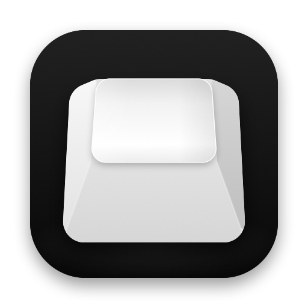
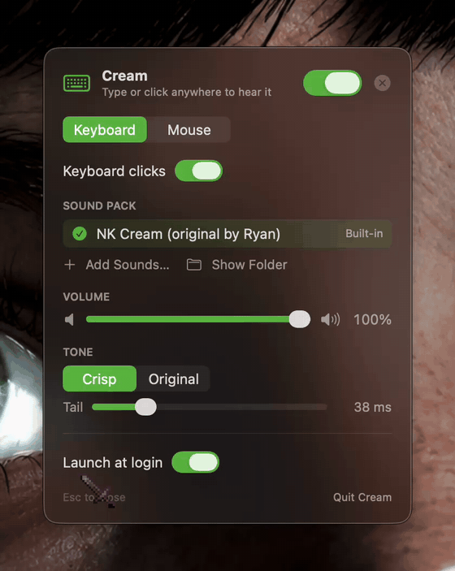
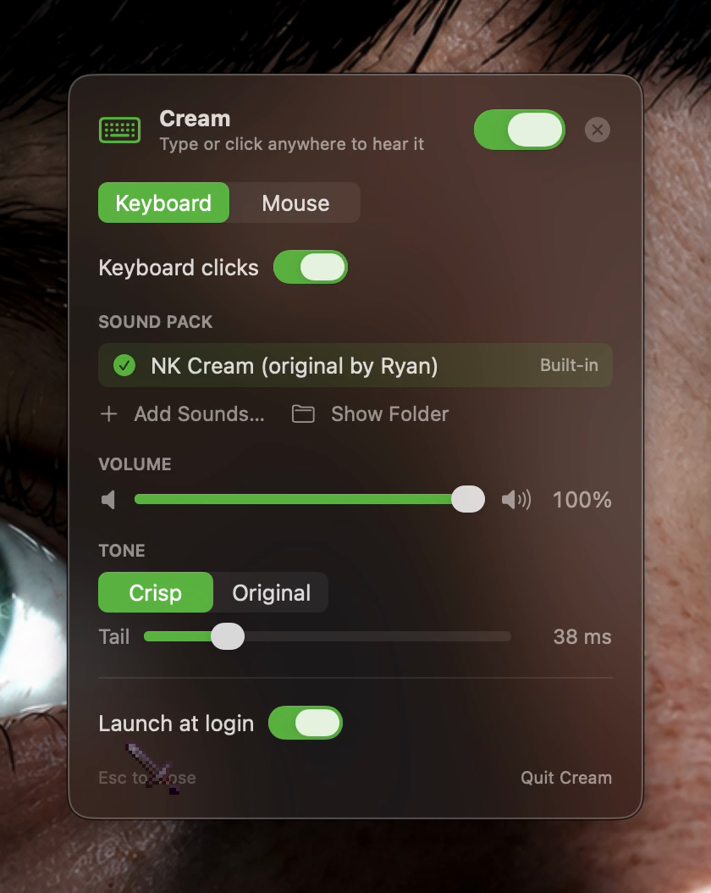
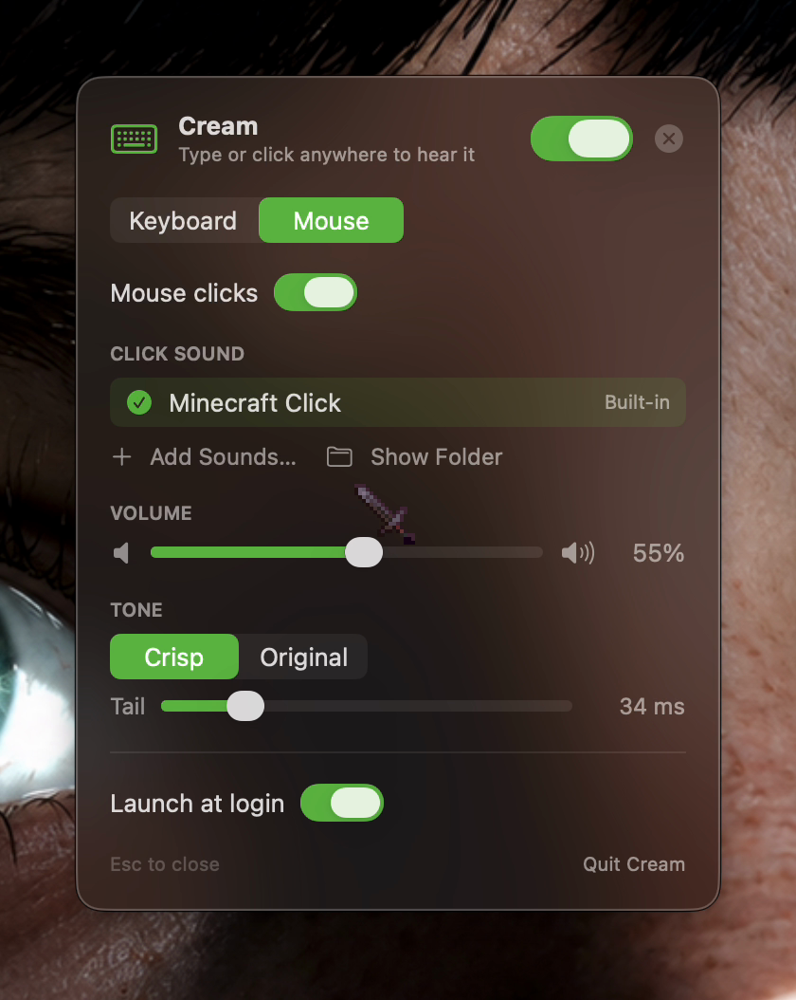

  

<h1 align="center">Cream</h1>

A macOS menu bar app for **customizing the sounds your keyboard and mouse make**.
Load any mechanical-keyboard sound pack and every key you type plays its own
recorded switch sound. Pick any audio file and every mouse click plays it. It
works system-wide, in every app, with no noticeable delay, and each device has
its own sound, volume and tone.

> **Sounds aren't included.** This repo is the app only. You bring the sounds:
> any Mechvibes keyboard pack, a folder of your own recordings, or any audio file
> for the mouse. See [Sounds](#sounds) below.

## What it does

### Keyboard

- Plays a per-key sound for everything you type: letters, space, enter, backspace,
  tab, shift, caps lock and so on. Each key uses its own sample from the pack,
  in the Mechvibes key layout.
- Modifier keys click on press, and held keys don't machine-gun on auto-repeat.
- Every press gets a small random volume change so fast typing doesn't sound robotic.
- **Sound packs:** **Add Sounds…** imports any Mechvibes pack (folder or `.zip`),
  or a folder of loose audio files. Files named after keys (`space.wav`,
  `enter.mp3`) go to those keys, and the rest cycle across all the others. Keep
  as many packs as you like and switch between them in Settings.

### Mouse

- A click sound for left, right and other mouse buttons.
- Add any audio files as click sounds and pick between them.

### Each device has its own

| Setting | What it does |
| --- | --- |
| On / off | Mute just keyboard or just mouse clicks |
| Sound | Pick the pack (keyboard) or click sound (mouse); user ones can be trashed |
| Volume | 0–100%, and it plays a preview when you let go of the slider |
| Tone | **Crisp** keeps only the key press and cuts the ringing. **Original** plays the full recording |
| Tail | How much sound Crisp keeps after the press, 10–150 ms |

  
  

### Menu bar

- The menu bar icon is a white keycap. **Left-click** it for a menu: master
  Sound On switch, Keyboard/Mouse Clicks on/off with a volume slider each,
  **Settings…** (⌘,) and Quit.
- **Right-click** (or ⌥-click) mutes or unmutes everything at once. While
  muted the icon is a crossed-out speaker.
- A warning triangle replaces the keycap while Input Monitoring permission is
  missing.

### Settings panel

A small floating, draggable card. Open it from the menu (**Settings…**) or by
launching Cream again from Spotlight, Raycast or Finder. It has the master switch,
the **Keyboard | Mouse** tabs above and **Launch at login**. Esc, ⌘W or × closes it
and hands focus back to the app you were in. Typing while it's open previews the
sounds without triggering the system alert beep.

## Sounds

The app bundles one default keyboard pack and one default click sound, which
`build.sh` copies in from `Sounds/`. They aren't in this repo (they're other
people's recordings), so put your own there before the first build:

    Sounds/
      nk-cream/       a Mechvibes "multi" pack: config.json + its audio files
      mouse/
        minecraft_click.mp3   any short click sound, under this file name

- **Keyboard:** any Mechvibes pack works. The community has hundreds; search for
  "Mechvibes sound packs" and pick one (the default slot is named for NK Cream,
  but any pack's files go in `Sounds/nk-cream/`).
- **Mouse:** any short audio file, renamed to `minecraft_click.mp3`.

`build.sh` stops with this explanation if either is missing. After that, add
more sounds anytime from Settings without rebuilding.

## Build & install

    ./build.sh           # compile, install to ~/Applications/Cream.app, launch
    ./build.sh --no-run  # compile + install only

Needs only the Xcode command line tools (`swiftc`) on an Apple Silicon Mac with
macOS 13 or later; there is no Xcode project.

## First run

macOS will ask for **Input Monitoring** permission. Turn Cream on in
System Settings → Privacy & Security → Input Monitoring. The app notices within
~2 seconds, and you don't need to relaunch it. Until then the menu bar icon is a warning triangle.

`build.sh` signs with a local self-signed certificate, "Cream Local Signing"
(login keychain), so the permission survives rebuilds. Without it, the build
falls back to ad-hoc signing and every rebuild needs a new grant.

**Only modifier keys click, letters are silent?** Input Monitoring isn't granted.
macOS still gives an untrusted listener modifier-key events but hides typed keys.

## Adding sounds

**Keyboard → Add Sounds…** accepts:
- a Mechvibes pack folder or `.zip` (both `multi` and `single` packs)
- a folder of audio files, or several audio files, without a config. Files named
  after keys (`space.wav`, `enter_key.mp3`, `a.ogg`) go to those keys, and every
  other key cycles through all the files.

**Mouse → Add Sounds…** takes one or more audio files; each becomes a click-sound
option, stored in `~/Library/Application Support/Cream/MouseSounds`.

Every sound has its leading silence trimmed on load (onset = start of the sound
containing the peak, so stray noise before a gap is dropped too). Without that,
a click file that opens with half a second of silence would lag every click.

Any format macOS decodes works: wav, mp3, m4a/aac, aiff, caf, flac, ogg (Vorbis
and Opus). Added packs live in `~/Library/Application Support/Cream/Packs`, and the
trash button moves one to the Trash.

## How it works

| File | Role |
|---|---|
| `Sources/main.swift` | App delegate: menu bar icon and menu, wires settings to the audio, opens the panel. |
| `Sources/MenuIcon.swift` | The menu bar keycap, drawn once into 1x/2x template bitmaps so macOS tints it for the menu bar. |
| `Icon/make-icon.swift` | Draws the app icon, a white mechanical keycap on a black tile; `build.sh` copies `Icon/AppIcon.icns` in. |
| `Sources/AppModel.swift` | All settings (UserDefaults-backed) plus live status, shared by the menu and the panel. |
| `Sources/SettingsPanel.swift` | Borderless floating SwiftUI panel. |
| `Sources/PanelProcess.swift` | Runs the panel as its own `Cream --panel` process that quits on close, and keeps its settings in step with the menu bar app over distributed notifications. |
| `Sources/MouseSound.swift` | Mouse click sounds: built-in + user library, import/remove, Crisp copy. |
| `Sources/PackStore.swift` | Lists, imports (folder/zip/files) and removes packs; generates a config for loose files. |
| `Sources/SoundPack.swift` | Parses config.json (multi/single), decodes and converts every sound to 44.1 kHz stereo, makes the Crisp copies. |
| `Sources/ClickEngine.swift` | `AVAudioEngine` with 16 round-robin voices; pauses after 15 s idle (resume takes ~3–6 ms). |
| `Sources/KeyListener.swift` | Listen-only `CGEventTap`: keyDown + modifier presses (no auto-repeat) and left/right/other mouse-button presses. |
| `Sources/KeyMap.swift` | macOS key code → PC set-1 scan code (Mechvibes numbering). |

## Crisp vs Original sound

Switch recordings typically run ~200–250 ms: the press (0–20 ms), a 1–3 kHz
spring/plate ring, then the key's *release* click ~100 ms later and more ringing.
At typing speed that smears into a buzz. **Crisp** (default) keeps the press, holds
25 ms past its peak, then fades out over 20 ms with a raised-cosine curve (~50 ms
total). The audio files are untouched; pick **Original** under Tone in Settings to
hear them as recorded. Adjust the tail length with the **Tail** slider (10–150 ms).

## Resource use (measured on Apple Silicon, macOS 26)

| State | Cream CPU | Memory | coreaudiod |
|---|---|---|---|
| Idle | 0.0% | ~15 MB | +0% |
| Typing ~72 WPM | ~0.7% of one core | ~20 MB | ~+10% of one core while typing |
| Typing ~120 WPM | ~0.8% | ~20 MB | ~+10% |
| Typing ~240 WPM | ~1.0% | ~20 MB | ~+10% |

The settings panel is a separate process, so its SwiftUI memory (~15 MB) goes
away when you close it instead of staying in the menu bar app for good.

## Credits

The screenshots show the author's own setup: the community Mechvibes pack "NK Cream
(original by Ryan)" and Minecraft's UI click sound. Neither is distributed here;
both belong to their original creators. Pack format by
[Mechvibes](https://mechvibes.com).
